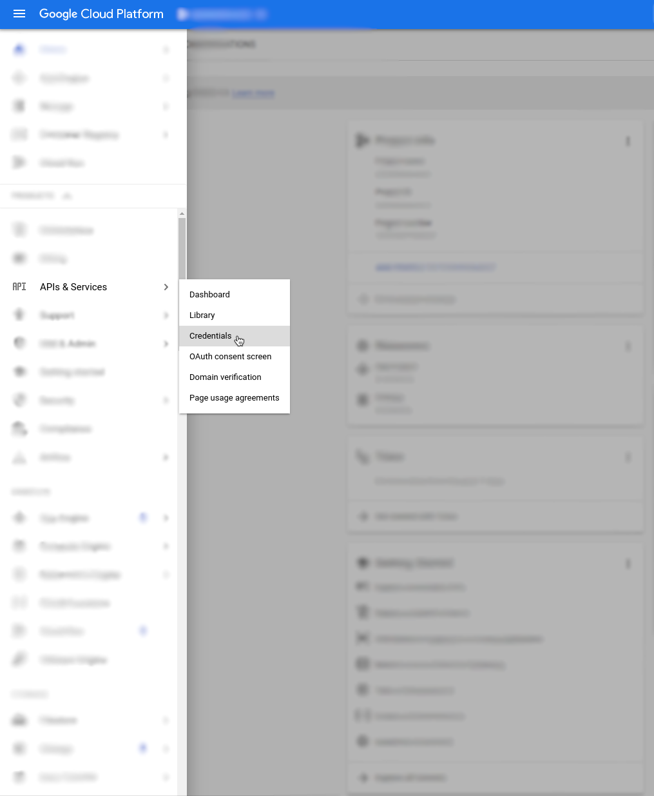
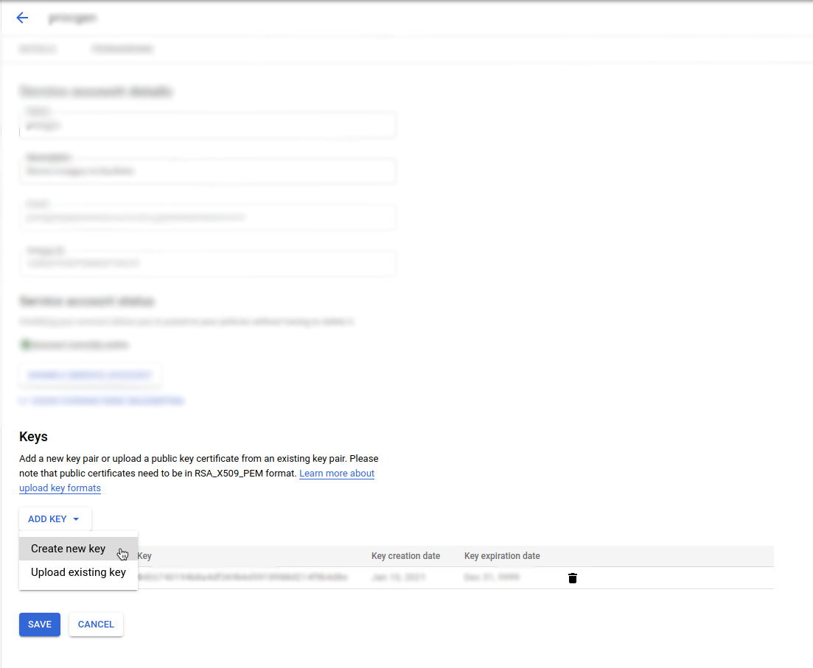
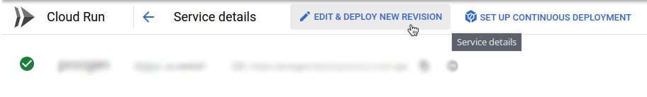
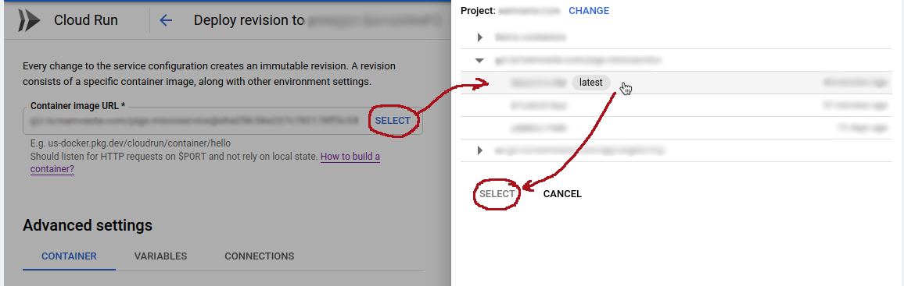

# Google Cloud Platform

The microservice is intended to connect to GCP so it can store images that it creates in a Cloud Storage bucket.

## Local Testing

1. Get your service account credentials
   1. In the GCP console, go to `APIs & Services > Credentials`. 
   2. Click on the service account you want to use, or create a new one. Make sure this service account has the appropriate permissions to create objects in your bucket.
   3. On the service account page, in the `Keys` section, click on `Add Key`. 
2. Move the downloaded `json` file somewhere safe. I recommend creating a `/env` directory in this repository.
3. Make sure the environment variable `GOOGLE_APPLICATION_CREDENTIALS` is set to the path to that file.
4. Add another environment variable called `GCS_BUCKET` set to the name of the bucket you want to save images to.

## Deploy

1. Make sure the `<image></image>` is set correctly in the `microservice-generator` project's `pom.xml`.
2. `cd` into the `/imageGenerator/microservice-generator` directory in this repository
3. Run `mvn compile jib:build`. The image will be built. 
   - If the container points to a container registry like gcr, it should automatically push it there too.
   - If deploying to gcr, you might need to do `gcloud auth login` first
   - For more info, google `Jib`

### Updating Google Cloud Run

1. Deploy to gcr following steps above
2. Go to the Cloud Run page in the GCP Console
3. Click on the service you want to update
4. Click `Edit & Deploy New Revision` 
5. In the `Container Image URL` input, click "Select", then select the image you want to use 
6. Click "Deploy" at the bottom of the form